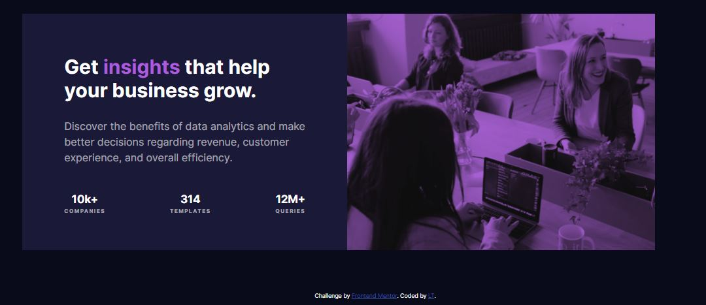

# Frontend Mentor - Stats preview card component


## Welcome! 👋

Thanks for checking out my front-end coding challenge solution from **Frontend Mentor**.

## Table of contents

- [Overview](#overview)
  - [The challenge](#the-challenge)
  - [Screenshot](#screenshot)
  - [Links](#links)
- [My process](#my-process)
  - [Built with](#built-with)
  - [What I learned](#what-i-learned)
  - [Continued development](#continued-development)
  - [Useful resources](#useful-resources)
- [Author](#author)
- [Acknowledgments](#acknowledgments)

## Overview

## The challenge

Your users should be able to:

- View the optimal layout depending on their device's screen size

### Screenshot





### Links

- Solution URL: [Add solution URL here](https://your-solution-url.com)
- Live Site URL: [Add live site URL here](https://your-live-site-url.com)

## My process

### Built with

- Semantic HTML5 markup
- CSS custom properties
- Flexbox
- Mobile-first workflow

### What I learned

This was my first Frontend Mentor challenge, and thrid time me building a complete website/webpage from a design. The challenge was good from the sense that the design of the webpage was brilliant, but also good for me because I got into plan my HTML mark-up and also think through how I will be applying my styles. 

**My approach**
- Build the mock-up with the mobile-design approach.
- Markout sections on the design that will be broken down into my HTML Markup
- Setup basic styles to be used for my typography.

**My challenges**
- Designing for mobile-first was intrestly not the most difficult part for this challenge. 
- Desktop design was the big challenge especially with the ```.card-img```
- At first I implemented my ```img``` in my HTML markup wrapped in a ```<div>``` and later realised in the desktop design that my ```img``` was not spanning the full size of the ```<div>``` element. 
- I then removed my ```img``` element in the ```<div>``` and added the ```img``` as a background img along with the other properties which solved my problem.

Code sample
```.card-img { margin-top: 3rem; margin-bottom: -0.35rem; width: 100%; min-height: 30vh; background-image:url("images/image-header-mobile.jpg"); background-color: #aa5cdb; background-size: cover; background-repeat: no-repeat background-blend-mode: multiply; filter: contrast(.9);}```

- The last bit of the challenge was then the media queries. Key challenge here was having to get the correct breakpoints for my code to ensure that the transition between desktop and mobile is smooth.

**Final takeaway**
- Definitely more practice in doing the challenges to get a good hang of building the designs, maybe I can start timing myself once I've completed 3 newbie projects.
- I'm happy on the outcome - there is always room for improvement and I undertake to check other peoples solutions and see how they approached doing this challenge.

### Continued development

- Accessibility
- Media queries 
- CSS Properties: vw, vh etc.

## Author

- Frontend Mentor - [@LT-WebDev](https://www.frontendmentor.io/profile/LT-WebDev)
- Twitter - [@IAM_letlotlo_](https://www.twitter.com/IAM_letlotlo_)
